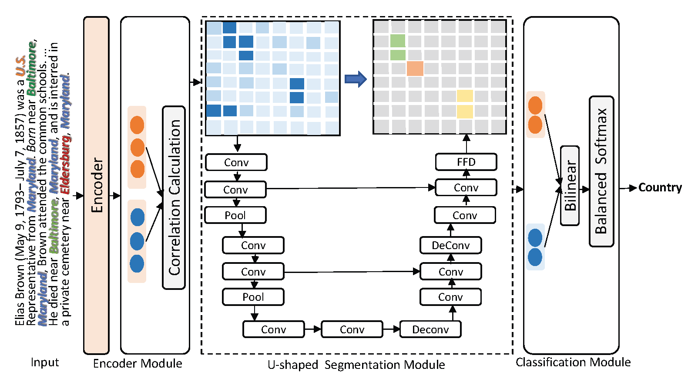

# DocuNet

- ❗NOTE: Docunet is integrated in the knowledge extraction toolkit [DeepKE](https://github.com/zjunlp/DeepKE).


# Brief Introduction
This paper innovatively proposes the DocuNet model, which first regards the document-level relation extraction as the semantic segmentation task in computer vision.


<div align=center></div>


# Requirements

To install requirements:

```setup
pip install -r requirements.txt
```


# Training

To train the DocuNet model in the paper on the dataset [DocRED](https://github.com/thunlp/DocRE), run this command:

```bash
>> bash scripts/run_docred.sh # use BERT/RoBERTa by setting --transformer-type
```

To train the DocuNet model in the paper on the dataset CDR and GDA, run this command:

```bash
>> bash scripts/run_cdr.sh  # for CDR
>> bash scripts/run_gda.sh  # for GDA
```


# Evaluation

To evaluate the trained model in the paper, you setting the `--load_path` argument in training scripts. The program will log the result of evaluation automatically. And for DocRED  it will generate a test file `result.json` in the official evaluation format. You can compress and submit it to Colab for the official test score.


# Results

Our model achieves the following performance on : 

## Document-level Relation Extraction on [DocRED](https://github.com/thunlp/DocRED)


| Model     | Ign F1 on Dev | F1 on Dev | Ign F1 on Test | F1 on Test |
| :----------------: |:--------------: | :------------: | ------------------ | ------------------ |
| DocuNet-BERT (base) |  59.86±0.13 |   61.83±0.19 |     59.93    |      61.86  |
| DocuNet-RoBERTa (large) | 62.23±0.12 | 64.12±0.14 | 62.39 | 64.55 |

## Document-level Relation Extraction on [CDR and GDA](https://github.com/fenchri/edge-oriented-graph)

| Model  |    CDR    | GDA |
| :----------------: | :----------------: | :----------------: |
| DocuNet-SciBERT (base) | 76.3±0.40    | 85.3±0.50  |


# Acknowledgement

Part of our code is borrowed from [https://github.com/wzhouad/ATLOP](https://github.com/wzhouad/ATLOP), many thanks.
You can refer to [https://github.com/fenchri/edge-oriented-graph](https://github.com/fenchri/edge-oriented-graph) for the detailed preprocessing process of GDA and CDR datasets (acquire the file of train_filter.data, dev_filter.data and test_filter.data).

